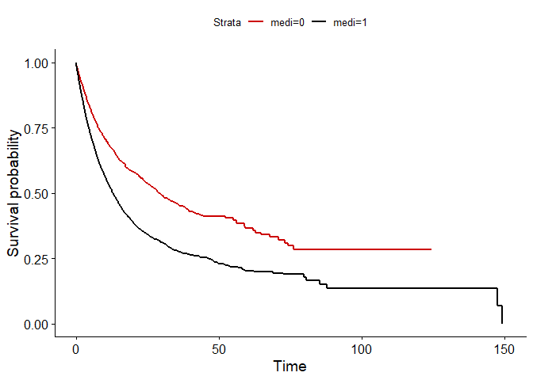
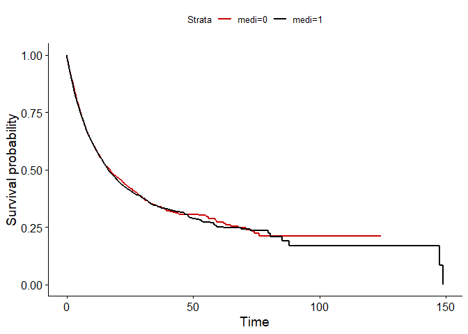

Adjusted survival curves
================
André Moser, CTU Bern, University of Bern

# Background

Unadjusted Kaplan-Meier curves from observational data might be biased
because of confounding (Cole and Hernán (2004)). This vignette
introduces the concept of inverse probability (IP) weighted survival
curves.

# Example

We consider a study population of 10,000 patients who received a
medication. 60% of the patients were women. In men, a specific enzym was
measured with a probability of 30%, whereas in women have a 5 times
higher chance of having the enzym. Those with the enzym were more likely
to receive the medication (with a probability of 75%), compared to those
without the enyzm (probability of 50%).

-   Research question: What is the effect of the medication on death?
-   Study design: Cohort study
-   Outcome of interest: Time to death or end of follow-up
-   Predictor of interest: Medication
-   Confounders: Sex, enzym

The used variables from the data are:

| Variable | Definition     | Coding                     |
|----------|----------------|----------------------------|
| female   | Sex            | 1=Women, 0=Men             |
| enzym    | Measured enzym | 1=Present, 0=Not present   |
| medi     | Medication     | 1=Received, 0=Not received |
| death    | Death          | 1=Death, 0=Alive           |
| fup      | Follow-up time | Non-negative number        |

## Knowledge from the crystal ball

Because we simulated the data, we know that medication has no effect on
mortality.

# Analysis strategy

IP weighting constructs weights which are equal to the probability of an
individual’s treatment (here: receiving the medication) given observed
covariates (here: sex and enzym) and creates pseudopopulations in which
observed covariates are independent of treatment (i.e. no confounding)
(Hernán and Robins (2022)).

``` r
# Required packages
library(tidyverse)
library(survey)
library(survival)
library(gtsummary)
library(survminer)
```

## Descriptive table

The table below shows a descriptive summary of the study population, by
medication.

``` r
data %>% tbl_summary(by=medi, label=list(medi ~ "Medication")) %>% as_kable() 
```

| **Characteristic** | **0**, N = 3,639 | **1**, N = 6,361 |
|:-------------------|:-----------------|:-----------------|
| fup                | 8 (3, 17)        | 6 (2, 13)        |
| death              | 1,225 (34%)      | 3,064 (48%)      |
| enzym              | 1,321 (36%)      | 3,973 (62%)      |
| female             | 1,972 (54%)      | 4,062 (64%)      |

## Unadjusted Kaplan-Meier curve and Cox-modelling

A naive (unadjusted) survival analysis of the data reveals the following
Kaplan-Meier plot. We conclude that the medication has an effect on
survival.

``` r
mod <- survfit(Surv(fup, death)~medi, data=data)
ggsurvplot(mod, data=data, palette=c("#CC0000", "black"), censor=F)
```

<!-- -->

``` r
mod_cox_unadjusted <- coxph(Surv(fup, death) ~ medi, data = data)
mod_cox_unadjusted
```

    ## Call:
    ## coxph(formula = Surv(fup, death) ~ medi, data = data)
    ## 
    ##         coef exp(coef) se(coef)     z      p
    ## medi 0.50613   1.65887  0.03385 14.95 <2e-16
    ## 
    ## Likelihood ratio test=238.4  on 1 df, p=< 2.2e-16
    ## n= 10000, number of events= 4289

An unadjusted Cox proportional hazard model shows that patients with
medication have 1.7 higher hazard of death compared to those without
medication.

``` r
mod_cox_adjusted <- coxph(Surv(fup, death) ~ medi+enzym+female, data = data)
mod_cox_adjusted
```

    ## Call:
    ## coxph(formula = Surv(fup, death) ~ medi + enzym + female, data = data)
    ## 
    ##            coef exp(coef) se(coef)      z      p
    ## medi    0.01610   1.01623  0.03445  0.467  0.640
    ## enzym   2.37236  10.72265  0.04703 50.441 <2e-16
    ## female  0.07087   1.07344  0.03552  1.995  0.046
    ## 
    ## Likelihood ratio test=4221  on 3 df, p=< 2.2e-16
    ## n= 10000, number of events= 4289

What happens if we adjust for enzym and sex? Then the effect of the
medication on death vanish (hazard ratio=1.02).

## IPW modelling

An IPW modelling approach construct treatment weights (here medication)
given known covariates (here sex and enzym) using a logistic regression
model.

``` r
# IPW denominator
mod <- glm(medi ~ female+enzym, data=data, family=binomial())

data$ipw <- NA
# Probabilty of treatment
data$ipw <- predict(mod, data=data, type="response")
# Probabilty of non-treatment
data$ipw[data$medi==0] <- 1-predict(mod, data=data, type="response")[data$medi==0]
```

We construct stabilized weights, since they can provide narrower
confidence intervals (Hernán and Robins (2022)).

``` r
# Stabilized weights
mod0 <- glm(medi ~ 1, data=data, family=binomial())
data$ipw0 <- predict(mod0, data=data, type="response")
data$ipw0[data$medi==0] <- 1-predict(mod0, data=data, type="response")[data$medi==0]
data$ipw <- data$ipw0/data$ipw
```

An IPW adjusted Kaplan-Meier curve reveals that medication has no effect
on survival:

``` r
# Set survey design
svy_design <- svydesign(id=~1, weights=~ipw, data=data)

# IPW adjusted Kaplan-Meier
km_fit <- svykm(Surv(fup, death) ~ medi, design=svy_design)

km_df <- data.frame(time=km_fit$`1`$time, surv=km_fit$`1`$surv, strata="medi=1")
km_df <- bind_rows(km_df, data.frame(time=km_fit$`0`$time, surv=km_fit$`0`$surv, strata="medi=0"))
ggsurvplot_df(km_df, palette=c("#CC0000", "black"), censor=F)
```

<!-- -->

``` r
mod_cox_ipw_adjusted <- svycoxph(Surv(fup, death) ~ medi, design=svy_design)
summary(mod_cox_ipw_adjusted)
```

    ## Independent Sampling design (with replacement)
    ## svydesign(id = ~1, weights = ~ipw, data = data)

    ## Call:
    ## svycoxph(formula = Surv(fup, death) ~ medi, design = svy_design)
    ## 
    ##   n= 10000, number of events= 4289 
    ## 
    ##         coef exp(coef) se(coef) robust se     z Pr(>|z|)
    ## medi 0.01669   1.01683  0.03192   0.03323 0.502    0.616
    ## 
    ##      exp(coef) exp(-coef) lower .95 upper .95
    ## medi     1.017     0.9835    0.9527     1.085
    ## 
    ## Concordance= 0.502  (se = 0.004 )
    ## Likelihood ratio test= NA  on 1 df,   p=NA
    ## Wald test            = 0.25  on 1 df,   p=0.6
    ## Score (logrank) test = NA  on 1 df,   p=NA
    ## 
    ##   (Note: the likelihood ratio and score tests assume independence of
    ##      observations within a cluster, the Wald and robust score tests do not).

This is confirmed by an IPW adjusted Cox regression model (hazard
ratio=1.02).

# Conclusion

Unadjusted Kaplan-Meier curves from observational data might be biased
because of confounding. IPW adjusted survival curves account for
confounding by constructing weights which are proportional to the
probability of treatment given known covariates. An advantage of IPW
adjusted Kaplan-Meier curves is that they provide marginal survival
estimates, in contrast to stratified plots (Cole and Hernán (2004)).

# Data simulation

``` r
set.seed(1)
n <- 10000

# 60% percent women
female <- rbinom(n, 1, 0.6)
# Men has the enzym with a prob of 0.3; women have
# a 5 times higher chance of having the enzym
enzym <- ifelse(runif(n) < plogis(qlogis(0.3)+log(5)*female), 1, 0)
# Those with enzym receive medication with prob 0.75
medi <- ifelse(runif(n) < plogis(log(3)*enzym), 1, 0)
# Hazard of dying: HR=10 of those with enyzm; No effect for medication
haz <- 0.01*exp(log(10)*enzym)
# Time to death
time_to_death <- -log(runif(n))/haz
# Censoring time: Mean duration 20 days
censored <- rweibull(n, 1, 20)
# Follow-up time
fup <- pmin(time_to_death, censored)
# Death
death <- ifelse(time_to_death<=censored, 1, 0)
# Data
data <- data.frame(fup, death, medi, enzym, female)
```

<div id="refs" class="references csl-bib-body hanging-indent">

<div id="ref-COLE200445" class="csl-entry">

Cole, Stephen R., and Miguel A. Hernán. 2004. “Adjusted Survival Curves
with Inverse Probability Weights.” *Computer Methods and Programs in
Biomedicine* 75 (1): 45–49.
<https://doi.org/10.1016/j.cmpb.2003.10.004>.

</div>

<div id="ref-hernan_book" class="csl-entry">

Hernán, MA, and JM Robins. 2022. *Causal Inference: What If*. Boca
Raton: Chapman & Hall/CRC.

</div>

</div>
