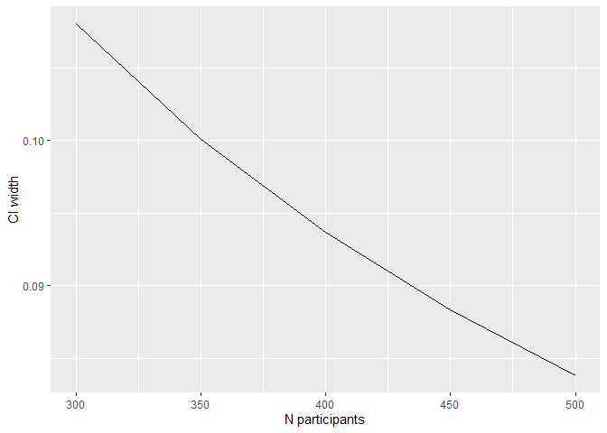

Sample size calculation
================
Author
21 4 2022

# Background

In clinical research, one of the first technical hurdles to a project is
the sample size calculation - how many participants would you need to
include to be able to answer your research question? They are required
by funding bodies, ethics and safety regulators. They can also be
important to the sponsor - without a good sample size calculation, how
can you tell if you will be able to achieve your aims?

<!-- Figure here of clinician/statistician discussion?? Michael Coslovsky used to have a funny one... -->

Speaking with a statistician about sample size calculation can be
frustrating for both parties. The investigator just wants a number that
they can write in their proposal/protocol/grant application. The
statistician cannot give a number without various details. Hence, a good
understanding from both sides is important. The aim of the study has to
be well defined and all the necessary numbers should be available,
either from data (clinical or published studies) or based on experience.
See the [What the statistician needs to
know](#what-the-statistician-needs-to-know) section for further
information.

There are two main paradigms in clinical trials - precision and null
hypothesis significance testing.

### Null hypothesis significance testing (NHST)

The aim is to assess if there is a statistical difference between
e.g. two groups. For example

-   does medication X lower Y more than medication Z
-   does surgery X results in fewer Y than surgery Z

There are two important concepts to understand in the NHST framework:
Type 1 error and Type 2 error, both of which are important for the
sample size calculation.

#### Type 1 error

A type 1 error is the rejection of the null hypothesis when it is
actually true (i.e. a false positive - e.g. a pregnant man). This is
controlled by the selection of
,
the test significance level, which is normally set at 0.05 (which
represents incorrectly rejecting the null hypothesis 5% of the time).
For more exploratory analyses, it might be relaxed to 0.1.

#### Type 2 error

Type 2 errors are failing to reject the null hypotheses when they are
actually false (i.e. a false negative - e.g. telling a pregnant woman
that she is not pregnant). This is controlled by the power, which is
generally set at 0.8.

### Precision based approaches

The focus is rather on estimating a quantity to a given accuracy. For
example, we might expect that 40% of people have a given event within a
certain time frame, but we want to estimate that 40% with a specific
precision, in other words within a certain interval, e.g. 5% (2.5% on
either side). We are interested in the width of the confidence interval
(CI). It is also possible to estimate width of the CI for differences
(e.g. mean differences) and relative effects (e.g. odds ratios, relative
risks).

### What the statistician needs to know

In order to perform a sample size calculation, the statistician will
need to know most of the following points. Depending on the question,
they might also need additional information. Typically, the more
complicated the analysis, the more information that is needed for the
sample size calculation.

#### What is the main comparison, if any?

Between two groups is the most common (e.g. intervention vs control).
This is the typical question in the NHST framework, but not so common in
where the goal is to estimate precision.

#### What is the primary endpoint?

-   what type of variable is it? Continuous? Binary? Time-to-event?
-   when is it measured? Thirty days? Six months? One year?

#### What effect do you expect to see?

-   if you have continuous data,
    -   will the difference in means be 10, 20, …, 100?
    -   What would the group means be?
    -   how variable are those quantities (e.g. what is the standard
        deviation?)
-   if you have binary data,
    -   what proportion of events do you expect in the groups?

What would constitute a *clinically relevant* effect for this outcome?
This is particularly important for non-inferiority trials.

<!-- Panel A in the following figure show densities with identical mean values (10), but different standard deviations. Testing a difference with the one on the left would require a much smaller sample size than for the case on the right. Data from those two distributions are shown in panel B. -->

# Quiz

Here is a short quiz to check your understanding…

<!-- Ideally, the correct answers would popup when the questions have been answered. That should be possible with a full blown website, but not on GitHub -->

###### Question 1: In a court room, the defendent is incorrectly sentenced to prison. This is an example of…

-   A. A type 1 error

-   B. A type 2 error

###### Question 2: Type 2 errors are controlled by

-   A. Test significance

-   B. Larger sample size

-   C. Power

-   D. Smaller variation between participants

###### Question 3: You suspect that there is a difference between treatments and want to quantify that difference to within a certain margin. What paradigm are you in?

-   A. Null-hypothesis testing

-   B. Bayesian

-   C. Precision

-   D. Frequentist

###### Question 4: Continuing from the Question 3. Suppose instead that you want to test if one treatment has a higher mean value of an outcome than the other treatment. What information would the statistician need to perform a sample size calculation? Check all that might apply.

-   A. The cost of determining the outcome

-   B. The mean value of the outcome in the relevant population

-   C. An estimate of the variability within the population

-   D. An estimate of the difference you expect to see between
    treatments

-   E. The number of individuals with the condition that pass through
    your institution per year

# Example(s)

Here we present a couple of very short examples of how sample size
calculations can be performed, although we do recommend discussing your
project with a statistician.

### The NHST framework

Suppose we want to estimate the mean difference between two groups
(intervention vs placebo) and would like to be able to test it against
“no difference”. We have to define which difference will be clinically
relevant to test. Let assume that a difference of 20 between both groups
is clinically relevant. We also need to guess in an educated way the
standard deviation (SD) of the outcome in the groups. Let assume a SD of
12 in each group. We also have to set the power we want to achieve and
the probability of type I error (alpha) we will allowed. In this example
a power of 90% with a two-sided alpha of 5% can be reached with a sample
size of 18, i.e. 9 participants in each group, to test if this
difference is equal to null.

Parameters to assume or set:

-   mean difference (delta)
-   standard deviations
-   power
-   probability of type I error (alpha)

``` r
power.t.test(delta = 20, sd = 12, sig.level = 0.05, power = .9,
             type = "two.sample",
             alternative = "two.sided")
```

    ## 
    ##      Two-sample t test power calculation 
    ## 
    ##               n = 8.649245
    ##           delta = 20
    ##              sd = 12
    ##       sig.level = 0.05
    ##           power = 0.9
    ##     alternative = two.sided
    ## 
    ## NOTE: n is number in *each* group

If the difference between both groups is smaller the requested sample
size to reach the same power with all the other parameters as above will
be larger. Similarly, increasing the larger variation around the mean
(larger standard deviation) also increases the sample size.

``` r
power.t.test(delta = 10, sd = 12, sig.level = 0.05, power = .9,
             type = "two.sample",
             alternative = "two.sided")
```

    ## 
    ##      Two-sample t test power calculation 
    ## 
    ##               n = 31.25372
    ##           delta = 10
    ##              sd = 12
    ##       sig.level = 0.05
    ##           power = 0.9
    ##     alternative = two.sided
    ## 
    ## NOTE: n is number in *each* group

Multiple plausible scenario can be investigated, by varying some
parameters. The [`sse` package](https://CRAN.R-project.org/package=sse)
(Fabbro (2021)), provides a mechanism to create multiple scenarios and
examine power in each, together with functions to aid reporting. `sse`
is very flexible, but does require some programming.

``` r
library(sse)

## defining the range of n and theta to be evaluated
psi <- powPar(
  # SD values
  theta = seq(from = 5, to = 20, by = 1),
  # sample sizes
  n = seq(from = 5, to = 50, by = 2),
  # group means
  muA = 0,
  muB = 20)

## define a function to return the power in each scenario
powFun <- function(psi){
  power.t.test(n = n(psi)/2,
               delta = pp(psi, "muA") - pp(psi, "muB"),
               sd = theta(psi)
  )$power
}

## evaluate the power-function for all combinations of n and theta
calc <- powCalc(psi, powFun)

## choose one particular example at theta of 1 and power of 0.9
pow <- powEx(calc, theta = 12, power = 0.9)

## drawing the power plot with 3 contour lines
plot(pow,
     xlab = "Standard Deviation",
     ylab = "Total Sample Size",
     at = c(0.85, 0.9, 0.95))
```

<!-- -->

For additional details, see the `sse` package documentation on
[CRAN](https://CRAN.R-project.org/package=sse).

### The precision based framework

Suppose we want to estimate the proportion of deaths within 30 days of a
myocardial infarction (MI). Law, Watt, and Wald (2002) estimated that
36% (31% - 40%) of patients died within 30 days of an MI. If we want to
replicate their study, we can estimate the number of participants that
would be necessary to achieve a CI which is 9% wide. Members of the SCTO
Statistics and Methodology platform created an R package specifically
for this problem called `presize` (Haynes et al. (2021)). It is
available on [CRAN](https://CRAN.R-project.org/package=presize) or as an
easy to use [shiny application](https://shiny.ctu.unibe.ch/presize/).

The relevant function in presize is the `prec_prop` function. Plugging
in the numbers from above, we can see that we require 434 participants
(column `n`) to yield a confidence interval from 31.6% (`lwr`) to 40.6%
(`upr`).

``` r
library(presize)
prec_prop(p = 0.36, conf.width = 0.09)
```

    ## 
    ##      sample size for a proportion with Wilson confidence interval. 
    ## 
    ##      p      padj        n conf.width conf.level       lwr       upr
    ## 1 0.36 0.3612296 433.5577       0.09       0.95 0.3162296 0.4062296
    ## 
    ## NOTE: padj is the adjusted proportion, from which the ci is calculated.

If we know that we can only afford to follow 300 participants, we can
see what the confidence interval would be in that case too, via the `n`
argument (instead of `cond.width`):

``` r
prec_prop(p = 0.36, n = 300)
```

    ## 
    ##      precision for a proportion with Wilson confidence interval. 
    ## 
    ##      p    padj   n conf.width conf.level       lwr       upr
    ## 1 0.36 0.36177 300  0.1080014       0.95 0.3077693 0.4157707
    ## 
    ## NOTE: padj is the adjusted proportion, from which the ci is calculated.

It’s also possible to check multiple scenarios, by passing multiple
values to a parameter. Below we vary the number of participants (what CI
width is possible to determine with that number of participants?):

``` r
prec_prop(p = .36, n = c(300, 350, 400, 450, 450))
```

    ## 
    ##      precision for a proportion with Wilson confidence interval. 
    ## 
    ##      p      padj   n conf.width conf.level       lwr       upr
    ## 1 0.36 0.3617700 300 0.10800136       0.95 0.3077693 0.4157707
    ## 2 0.36 0.3615199 350 0.10007265       0.95 0.3114836 0.4115562
    ## 3 0.36 0.3613317 400 0.09366763       0.95 0.3144979 0.4081655
    ## 4 0.36 0.3611850 450 0.08835346       0.95 0.3170083 0.4053617
    ## 5 0.36 0.3611850 450 0.08835346       0.95 0.3170083 0.4053617
    ## 
    ## NOTE: padj is the adjusted proportion, from which the ci is calculated.

The results can also be plotted easily, which is particularly useful
when running multiple scenarios.

``` r
library(ggplot2)  # for plotting
library(magrittr) # for 'piping'

prec_prop(p = .36, n = c(300, 350, 400, 450, 500)) %>% 
  as.data.frame() %>% 
  ggplot(aes(x = n, y = conf.width)) +
  geom_line() +
  labs(x = "N participants", 
       y = "CI width")
```

<!-- -->

For additional details and examples, see the [`presize`
website](https://ctu-bern.github.io/presize/).

# Conclusion

Sample size calculation is a very important part of the study planning
process. To make the most of your meeting with the statistician, have
the answers to the questions mentioned above.

# Quiz answers

Question 1: A (it’s a false positive).  
Question 2: B or C (a larger sample increases power which reduces the
risk of a type 2 error).  
Question 3: C (you’re not testing a difference, just trying the estimate
the quantity to within a given limit).  
Question 4: B, C, and D (these are all important. E can also be useful
for approximating trial duration.

# References

<div id="refs" class="references csl-bib-body hanging-indent">

<div id="ref-sse" class="csl-entry">

Fabbro, Thomas. 2021. *Sse: Sample Size Estimation*.
<https://CRAN.R-project.org/package=sse>.

</div>

<div id="ref-presize" class="csl-entry">

Haynes, Alan G., Armando Lenz, Odile Stalder, and Andreas Limacher.
2021. “‘Presize‘: An r-Package for Precision-Based Sample Size
Calculation in Clinical Research.” *Journal of Open Source Software* 6
(60): 3118. <https://doi.org/10.21105/joss.03118>.

</div>

<div id="ref-law2002" class="csl-entry">

Law, Malcolm R., Hilary C. Watt, and Nicholas J. Wald. 2002. “<span
class="nocase">The Underlying Risk of Death After Myocardial Infarction
in the Absence of Treatment</span>.” *Archives of Internal Medicine* 162
(21): 2405–10. <https://doi.org/10.1001/archinte.162.21.2405>.

</div>

</div>
